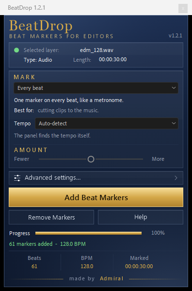

# BeatDrop

**Beat and hit markers for Adobe After Effects.** Select your music layer, pick what to
mark, click once. Free and open source: no account, no license key, no network.



## What it marks

| Mode | Marks | Best for |
|---|---|---|
| **Every beat** | One marker on every beat, like a metronome | cutting clips to the music |
| **Kick & bass hits** | Only the deep hits: kick drum, 808, bass | impacts, zooms and shakes |
| **Snare & clap hits** | Snares and claps, plus other sharp mid sounds | flashes, text pops, glitches |
| **Hi-hats & fast hits** | Only the fast, bright hits: hi-hats, shakers | quick flickers and small details |
| **Every hit** | Every strong sound in the song, any instrument | speech, sound effects, no drums |

**Amount** sets how many markers you get. For *Every beat*, **Tempo** can follow the
detected tempo, halve or double it, or take an exact BPM. After a run the result line
shows the tempo, and says `(or 174.0)` when the other speed fits the music almost as well.

Everything else (time range, where the markers go, spacing, offset, color, precision,
maximum count, using your own Audio Amplitude layer) sits under **Advanced settings...**
in its own window. Every control explains itself in a tooltip. The whole run is one undo step.

## Install

1. Download `Admiral_BeatDrop.jsx` from the latest release.
2. In After Effects: **File > Scripts > Install ScriptUI Panel...** and choose the file,
   then restart After Effects.
   *Or* copy the file by hand into
   `Adobe After Effects <version>/Support Files/Scripts/ScriptUI Panels/`.
3. Open it from the **Window** menu: **Window > Admiral_BeatDrop.jsx**.

Requires After Effects 2022 or newer. Tested on Windows 11 with After Effects 2024 (24.6),
English interface. macOS and non-English After Effects have not been tested yet - feedback
is welcome.

To check a download, compare its SHA-256 with `SHA256SUMS.txt` in the release
(PowerShell: `Get-FileHash Admiral_BeatDrop.jsx`).

## Using it

1. Open your composition and click the music layer in the timeline.
2. Choose what to mark. *Every beat* is best for cutting to music.
3. Click **Add Beat Markers**.

Tips:

- Too many markers? Move Amount to the left. Missing some? Move it to the right.
- Beat markers twice too many or too few? Tempo > Half speed or Double speed.
- Markers a little early or late? Advanced settings > Offset.
- Kick markers inside a long 808 note? Move Amount to about 20.
- **Remove Markers** deletes only the markers this panel made; yours stay.

## Long edits

BeatDrop works on 20-30 minute timelines as well as on songs: a 30-minute track with
Every beat took about 2.5 minutes in After Effects 24.6. Writing thousands of markers is
slow in After Effects itself, so before a very large run the panel tells you how long it
will take and asks first. After thousands of markers, save, close and reopen the project:
After Effects frees the memory and works fast again.

A long edit with several songs at different tempos is split into parts, each marked at its
own tempo; the result line and its tooltip list them.

## How well it works

On the test songs in `tests/` (eight styles with known hit times), F1 from 0 to 1:

| Mode | v1.0 | v1.2 |
|---|---|---|
| Every beat | 0.61 | 0.95 |
| Kick & bass hits | 0.79 | 0.92 |
| Snare & clap hits | 0.56 | 0.96 |
| Hi-hats & fast hits | 0.54 | 0.82 |
| Every hit | 0.87 | 0.96 |

Whether a song is "at" 87 or 174 BPM is often a matter of feel; the `(or ...)` hint and the
Tempo setting make switching one click.

## Known limits

- **Hi-hats & fast hits** on a song without hi-hats marks other bright sounds.
- **Kick & bass hits**: some kicks under a long 808 note are missed, and in some phonk
  tracks markers land inside held 808 notes. Lowering Amount removes most of the latter.
- **Snare & clap hits** also marks other sharp mid-range sounds (the name says so).
- A layer time-stretched to 200% really is at half the tempo (After Effects lowers its
  pitch too), so it gets twice the beat markers.

## Privacy

The panel writes no files (except, on an After Effects build that cannot read an image
from a string, its images into the system temp folder), launches no processes and uses no
network. Its settings are stored in After Effects' own preferences, so installing a new
version keeps them.

## Building from source

The panel ships as one self-contained `.jsx`, built from `src/` with

```
py -3 build.py
```

which writes `dist/Admiral_BeatDrop.jsx` and `dist/SHA256SUMS.txt`. The artwork in
`src/assets` is drawn by `tools/gen_assets.ps1` and `tools/make_glass.py`. Tests are in
[tests/](tests/README.md); changes are in [CHANGELOG.md](CHANGELOG.md).

## License

Copyright (C) 2026 Amirhossein Asadi.

BeatDrop is free software under the [GNU General Public License v3.0 or later](LICENSE):
you may use it, share it and change it; if you share a changed version, you share its
source under the same license.

---

made by Admiral
